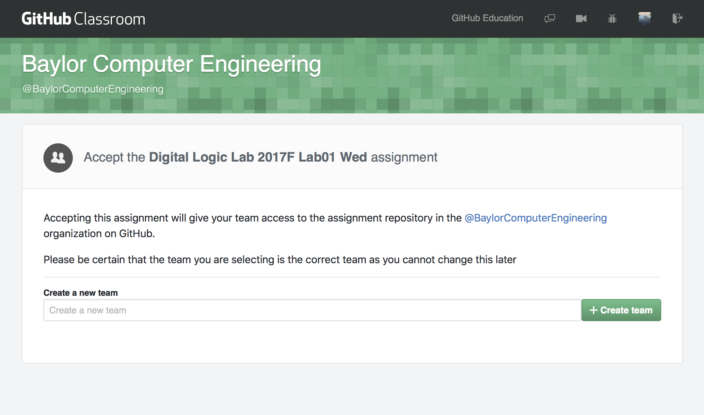

# Instructions for Lab 1 fix for Digital Logic Lab 2017 Fall Wednesday Session

As of Wednesday night, github classroom's bug was fixed. Everybody should log onto github.com and go to https://classroom.github.com 
to have github classroom app authorized. Once your account is authroized, the following instruction should guide you through to setup
assignment 1, and then you should submit assignment 1 as we have discussed in class.

## Team assignmnet

    1. Communicate with your teammate so that only one of you is doing the following instruction:
       a. Go to assignment page https://classroom.github.com/g/VuuFnidR, you should see something like this:
       
