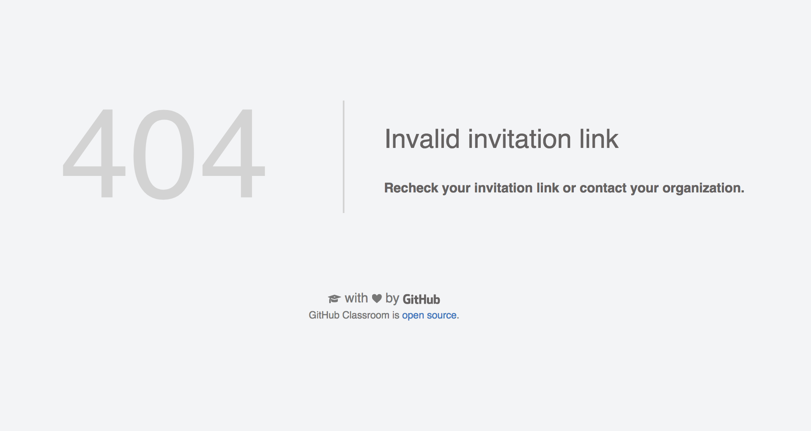
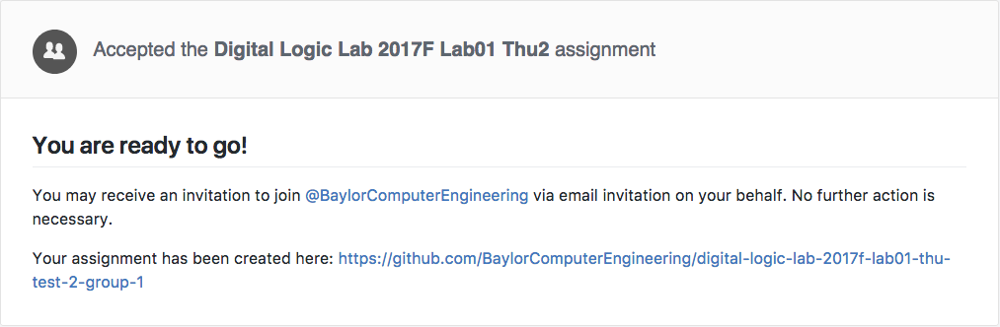
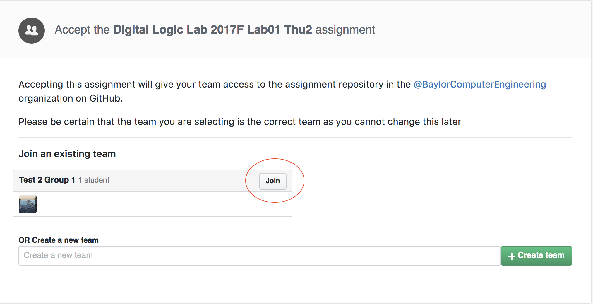
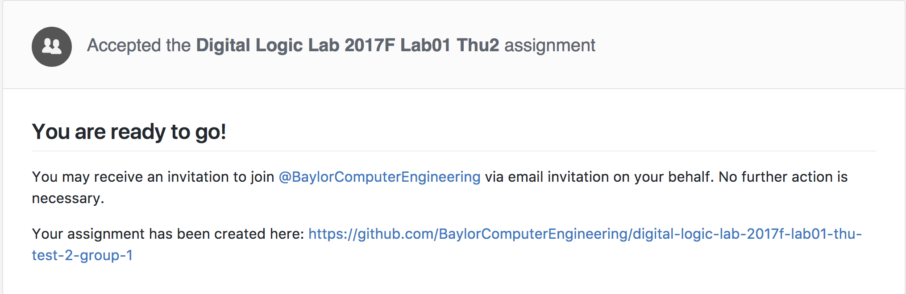

# Instructions for Lab 1 fix for Digital Logic Lab 2017

As of Wednesday night, github classroom's bug was fixed. Everybody should log onto github.com and go to https://classroom.github.com 
to have github classroom app authorized. Once your account is authroized, the following instruction should guide you through to setup
assignment 1, and then you should submit assignment 1 as we have discussed in class.

## Team assignmnet

### Creating a team

Use the following instruction to create lab group:

  - There must be **only one** student from each group to create team.
    So make sure you communicate with your other group member to decide who is going to create a group.

  - Name your team name starting with prefix "DL2017F_", and try not to have any space in the team name

  - Go to your assignment page specified in the email.
    
  - Once you are there, you will see a page like this:
    

<!-- accept</img> -->

  - Enter your desired group/team name, and press "Create Team" button. 
 
  - Github classroom is still in beta, so some of its behaviors could be weird. After creating a team,
    you may direct you to a 404 page like this:
    

Don't panic. All you need to do is to press the "back" button on your browser to go back to previous page,
and refresh that page. Then you should see confirmation page like this:
    

Now you can go to your assignment repository page by clicking on the link shown in confirmation page, or
go to https://github.com/BaylorComputerEngineering and your assignment link should be listed there.
       
### Joining a team

Once your partner tells you that the team is created, you can then join the team by going to the same
invitation link I sent you. Once you are there, you should see your team list above the creating team
option:

Join the team by clicking on "Join" button which might direct you to a 404 page like this:

Don't panic. All you need to do is to go back to previous page by pressing "Back" button in your browser,
and refresh that page. Then you should see confirmation page like this:
    

Now you can go to your assignment repository page by clicking on the link shown in confirmation page, or
go to https://github.com/BaylorComputerEngineering and your assignment link should be listed there.

### Change Team

In the scenario where you accidentally joined the wrong team, email me your username and the team you are
supposed to be in.

